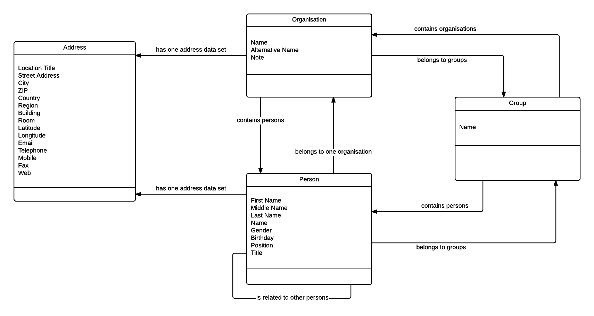

.. ==================================================
.. FOR YOUR INFORMATION
.. --------------------------------------------------
.. -*- coding: utf-8 -*- with BOM.

.. include:: ../Includes.txt

.. _introduction:

Introduction
============

.. _what-it-does:

What does it do?
----------------

This address organisation tool is developed to help store a little more complex address data and display it. It is
possible to create organisations and persons and because of the relations between them and the possibility to combine
them into groups, more complex structures like contact persons or departments can be simulated.

   Relations in fnn_address
